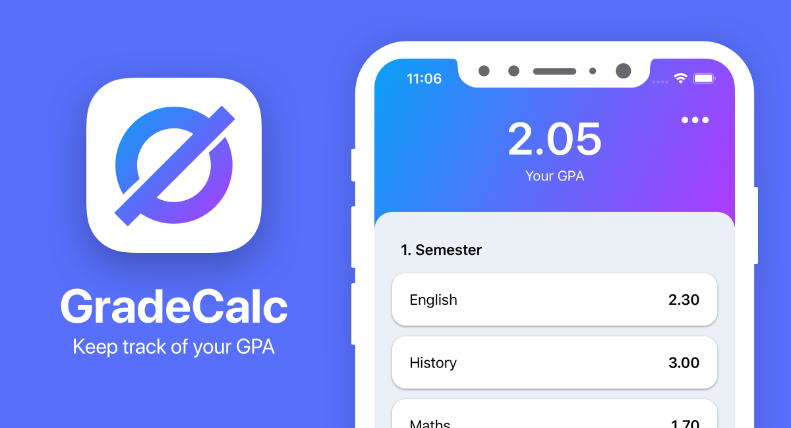

# Student Tools

## Future Work
1. More calculations the calculator will provide.
2. Complete the ToDo List feature.
3. Improve the pomodoro timer to allow choosing time in hours, minutes and seconds.
4. Improve pomodoro to provide break time between sessions.

## Note
This app is a combination of open-source codes of a Calculator, GPA calculator, Timer, and other original codes for editing, customizing and linking.

## ___________________________________________
## GradeCalc - GPA Calculator

## Copyright

This project has no license. That means you are not allowed to sell or distribute this app.
All rights reserved.
© 2020 Marlon Lückert

